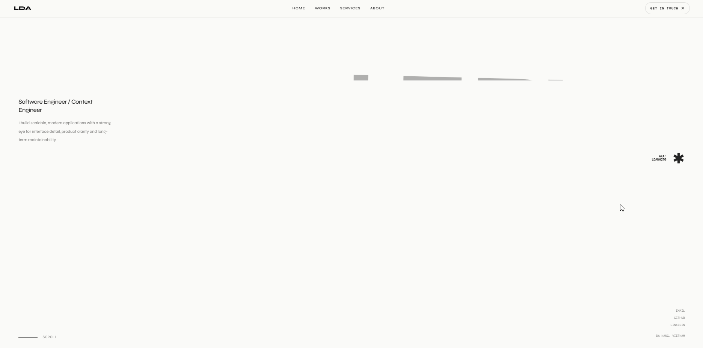

<h1 align="center">👋 Hi, I'm Lê Đức Anh</h1>

<p align="center">
  Software Engineer | Competitive Programming | Fullstack Developer
</p>

<p align="center">
  
  
  
  
</p>

<br>

<p align="center">
  <a href="https://ldadev.vercel.app/" target="_blank">
    
  </a>
</p>

<br>

<h1 align="center">CONTACTS</h1>

<p align="center">
  <a href="https://ldadev.vercel.app/" target="_blank"></a>
  <a href="https://facebook.com/ldanh170" target="_blank"></a>
  <a href="https://linkedin.com/in/ldanh170" target="_blank"></a>
  <a href="mailto:ducanhle.dn@gmail.com" target="_blank"></a>
  <a href="https://github.com/ldanh270" target="_blank"></a>
  <a href="https://t.me/ldanh270" target="_blank"></a>
</p>

<br>

<h1 align="center">TECH STACKS</h1>

<table align="center">
<tr>
<td align="left"><b>Languages</b></td>
<td>
  
  
  
  
  
  
  
  
</td>
</tr>

<tr>
<td align="left"><b>Frontend</b></td>
<td>
  
  
  
  
  
  
  
</td>
</tr>

<tr>
<td align="left"><b>Web3</b></td>
<td>
  
</td>
</tr>

<tr>
<td align="left"><b>Backend</b></td>
<td>
  
  
  
  
</td>
</tr>

<tr>
<td align="left"><b>Database</b></td>
<td>
  
  
  
</td>
</tr>

<tr>
<td align="left"><b>CI/CD</b></td>
<td>
  
  
  
  
  
  
  
  
  
</td>
</tr>

<tr>
<td align="left"><b>Tools</b></td>
<td>
  
  
  
</td>
</tr>

<tr>
<td align="left"><b>Agent & AI</b></td>
<td>
  
  
  
</td>
</tr>
</table>

<br>

<h1 align="center">MY STATS</h1>

<p align="center">
  
</p>

<p align="center">
  
  
</p>

<p align="center">
  
  
</p>

<br>

<h1 align="center">WAKATIME STATS</h1>

<!--START_SECTION:waka-->


**🐱 My GitHub Data** 

> 📦 221.9 kB Used in GitHub's Storage 
 > 
> 🏆 1,331 Contributions in the Year 2026
 > 
> 💼 Opted to Hire
 > 
> 📜 22 Public Repositories 
 > 
> 🔑 13 Private Repositories 
 > 
**I'm an Early 🐤** 

```text
🌞 Morning                1012 commits        ████░░░░░░░░░░░░░░░░░░░░░   17.51 % 
🌆 Daytime                2294 commits        ██████████░░░░░░░░░░░░░░░   39.69 % 
🌃 Evening                2059 commits        █████████░░░░░░░░░░░░░░░░   35.62 % 
🌙 Night                  415 commits         ██░░░░░░░░░░░░░░░░░░░░░░░   07.18 % 
```
📅 **I'm Most Productive on Saturday** 

```text
Monday                   746 commits         ███░░░░░░░░░░░░░░░░░░░░░░   12.91 % 
Tuesday                  979 commits         ████░░░░░░░░░░░░░░░░░░░░░   16.94 % 
Wednesday                707 commits         ███░░░░░░░░░░░░░░░░░░░░░░   12.23 % 
Thursday                 915 commits         ████░░░░░░░░░░░░░░░░░░░░░   15.83 % 
Friday                   422 commits         ██░░░░░░░░░░░░░░░░░░░░░░░   07.30 % 
Saturday                 1117 commits        █████░░░░░░░░░░░░░░░░░░░░   19.33 % 
Sunday                   894 commits         ████░░░░░░░░░░░░░░░░░░░░░   15.47 % 
```


📊 **This Week I Spent My Time On** 

```text
🕑︎ Time Zone: Asia/Ho_Chi_Minh

💬 Programming Languages: 
Markdown                 11 hrs 35 mins      ███████████░░░░░░░░░░░░░░   45.86 % 
TypeScript               6 hrs 33 mins       ██████░░░░░░░░░░░░░░░░░░░   25.94 % 
Bash                     2 hrs 1 min         ██░░░░░░░░░░░░░░░░░░░░░░░   08.03 % 
JavaScript               1 hr 57 mins        ██░░░░░░░░░░░░░░░░░░░░░░░   07.75 % 
JSON                     1 hr 16 mins        █░░░░░░░░░░░░░░░░░░░░░░░░   05.07 % 

🔥 Editors: 
Codex Vscode             17 hrs 22 mins      █████████████████░░░░░░░░   68.75 % 
VS Code                  7 hrs 53 mins       ████████░░░░░░░░░░░░░░░░░   31.25 % 

🐱‍💻 Projects: 
finwise                  25 hrs 7 mins       █████████████████████████   99.42 % 
Obsidian                 8 mins              ░░░░░░░░░░░░░░░░░░░░░░░░░   00.58 % 

💻 Operating System: 
Windows                  25 hrs 16 mins      █████████████████████████   100.00 % 
```

🤖 **AI Coding This Week** 

```text
⏱ AI Coding Time: 24 hrs 51 mins (98.35%)

✍️ 32,262 lines written by AI, 21 lines written by hand (99.93% AI-written)

🔤 11,896,218 Input Tokens, 1,692,778 Output Tokens

💵 $68.65 Estimated AI Cost This Week

🧠 42 AI Sessions, 246 AI Prompts

GPT                      32,028 lines        ████████████████████████░   97.94 % 
Codex-Vscode             673 lines           █░░░░░░░░░░░░░░░░░░░░░░░░   02.06 % 

🔎 AI Coding Insights:
🤖 AI-Driven — 99.93% of written lines came from AI
📚 Verbose Prompter — average 25,285 characters per prompt
🔁 Iterative Prompter — average 6 prompts per session
🚀 High AI Trust — 0.08% of changed lines were hand-edited
```

**I Mostly Code in TypeScript** 

```text
TypeScript               21 repos            ███████████░░░░░░░░░░░░░░   45.65 % 
JavaScript               10 repos            █████░░░░░░░░░░░░░░░░░░░░   21.74 % 
Java                     3 repos             ██░░░░░░░░░░░░░░░░░░░░░░░   06.52 % 
CSS                      2 repos             █░░░░░░░░░░░░░░░░░░░░░░░░   04.35 % 
Kotlin                   1 repo              █░░░░░░░░░░░░░░░░░░░░░░░░   02.17 % 
```


 Last Updated on 07/09/2026 03:05:46 UTC
<!--END_SECTION:waka-->
